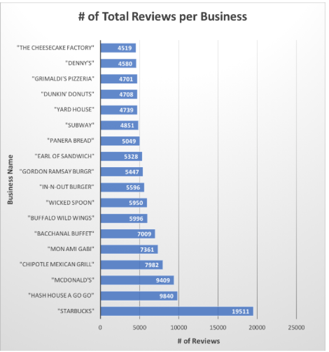

# Group 6 Project
Group 6, Katherine Matthers, Akina Hays, Aiqi Chen, Yingjin Wang. We used 3 different datasets in this project.

## Description of datasets.yelp_business
This table includes various data gathered on Yelp including users, reviews, ratings, business addresses and catergories.

## Question #1
What are the top 5 states with the most 5 star businesses? 

```sql
Select count(stars) as count_of_5_stars, state
From datasets.yelp_business
where stars = 5
group by state
order by count_of_5_stars DESC
```


## Question #2
What are the top 5 cities with the most 5 star businesses? Limit visualization to 10.

```sql
Select count(stars) as count_of_5_stars, city
From datasets.yelp_business
where stars = 5
group by city
order by count_of_5_stars DESC
```


## Question #3
What are the top 5 businesses with the most reviews?

```sql
Select sum (review_count) as count_of_reviews, name
From datasets.yelp_business
group by name
order by count_of_reviews DESC
limit 50
```


